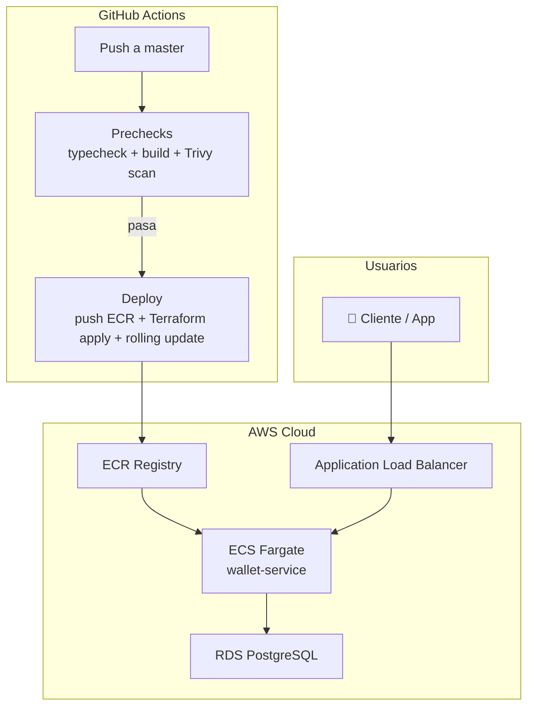

# Secure Wallet API

> Infraestructura de pagos con CI/CD completo para equipos que quieren dormir tranquilos.



---

## Para qué sirve esto

Tu equipo lanza features rápido, pero cada deploy es una apuesta. ¿Vulnerabilidades? ¿Rollbacks manuales? ¿"En mi máquina funciona"?

**Esta API demuestra que no tiene por qué ser así.**

Cada push a `master` se escanea, se testea, se construye y se despliega solo. Si algo falla, el pipeline se detiene antes de que llegue a producción. Si una vulnerabilidad crítica se detecta, el deploy se bloquea automáticamente.

No es magia. Es automatización bien hecha.

---

## Cómo lo hace

### "Deploy sin miedo"

TypeScript → Docker → Trivy scan → ECR → ECS Fargate (rolling update). Cero downtime. Cero intervención manual.

### "Seguridad desde el minuto cero"

Trivy en el pipeline bloquea cualquier imagen con CVEs HIGH o CRITICAL. No se negocia. No hay excepciones.

### "Lo que no está escrito, no existe"

Toda la infraestructura es código: VPC, subnets, RDS, ECS, ALB. Cambios con `git blame`. Rollbacks con `git revert`. No más "oye DevOps, créame una base de datos".

### "Si algo falla, te enteras antes que tus usuarios"

Logs centralizados en CloudWatch. Health checks cada 30 segundos. ECS reinicia automáticamente tareas en fallo.

---

## Decisiones que tomamos (y por qué)

| Decisión | Alternativa descartada | Razón |
|----------|------------------------|-------|
| **ECS Fargate** | EC2 tradicional | Sin parchear SO, sin dimensionar máquinas. El equipo programa, no administra servidores. |
| **Terraform** | CloudFormation / ClickOps | Multi-cloud ready, HCL más legible, estado remoto evita el "en mi máquina funciona". |
| **Node.js + TypeScript** | Python / Go | Tipado fuerte sin perder velocidad de desarrollo. El ecosistema npm y la facilidad para contratar talento pesan más. |
| **Transacciones atómicas** | Queries sueltos sin wrapper | Si un pago se parte (debita a A pero no acredita a B), pierdes dinero y confianza. Una transacción SQL lo garantiza. |
| **Trivy en el CI** | Snyk de pago / escaneo manual | Open source, sin licencias costosas, integración nativa con GitHub Actions. |
| **Rolling update** | Blue-green / Recreate | Cero downtime con el mínimo de recursos. No necesitas duplicar la infraestructura. |
| **Infraestructura en repo separado** | Monorepo único | La infra vive más que la app. Si cambias de lenguaje, la VPC y la base de datos no deberían moverse. |

---

## Dos repos, una arquitectura

Este proyecto se divide en dos repositorios a propósito:

```
secure-wallet-api-infra  →  Red, base de datos, clúster, roles IAM, ALB
secure-wallet-api        →  App, Dockerfile, CI/CD, task definition, ECS service
```

**¿Por qué separarlos?**

La infraestructura base (VPC, RDS, ALB, clúster) cambia muy poco — quizá una vez al año o nunca. La aplicación cambia a diario. Juntarlos genera ruido, pipelines más largos y riesgo de romper la base de datos sin querer.

Esta separación permite que equipos distintos evolucionen a ritmos distintos. La app itera rápido; la infra se mantiene estable.

**Orden de despliegue:**

1. Despliega primero la infraestructura base: [`secure-wallet-api-infra`](https://github.com/agomezala/secure-wallet-api-infra)
2. Luego despliega esta app — los outputs de Terraform del primer repo alimentan al segundo automáticamente

---

## Tecnologías

Node.js · TypeScript · PostgreSQL · ECS Fargate · Terraform · Docker · GitHub Actions · Trivy · Alpine Linux

---

## Documentación técnica

Guías detalladas de desarrollo local, arquitectura, despliegue y troubleshooting en →
[`docs/README.md`](docs/README.md)
